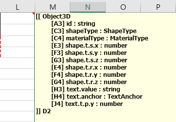

# Writing DataTableSchema

[DataTableSchema][] is defined in the cell comment inside the sheet that contains the table to be parsed.

Cell comments must be in the same sheet as the table, regardless of their location.

The following pictures show some of the tables defined in the example file **XlsxParser_02.xlsx**.

* * *
**picture-1** 

* * *
As shown in **picture-1**, the table does not restrict the freedom of expression except that the row or column must be a fixed length depending on the direction of parsing.

This means that when you create a table, you can work only with readability and ease-of-use and efficiency, without considering other factors. 

The red dotted rectangle is called the **block** and is the minimum range that contains all of the [Field][] defined in the schema.

**block** will be a row in [DataTable][] after being parsed by [XlsxParser][].

[DataTable][] creation is completed when all [Field][] values of the block is empty or when the end of the sheet is reached. However, if only parts of **block** have value, an error is stored in [DataTable][] and the creation is completed.

The parsing of [XlsxParser][] will continue without whether errors occurred. 

* * *
**picture-2** 

* * *
**picture-2** shows a schema that defines the table of **picture-1** in the cell comment.

One thing to note is that you must start with the string "\[\[" without any whitespace.
If not, [XlsxParser][] will treat it as a common cell comment and will not do anything.

The string after the "\[\[" in the first line is the name of the table and can get from [DataTableSchema.name][].

From the second line to previous of the last line is part that define the [Field][].

The value inside the "\[ \]" at the beginning of the line indicates the address of [Field][] in the start **block** and You can get the value by using [Row.startRef][] and [Field.rowOffset][], [Field.colOffset][]. 
The format of the address is **A1 style** and absolute address. 

The string up to the next ':' character is the name of [Field][] and can get from [Field.name][].

The part after the ':' character is the type of [Field][] and can get from [Field.type][]. 
The basic types provided by **XlsxParser** are as follows. 

Type | Descryption
---- | -----------
string  | The string. Same as **System.String**.
number  | The number. Same as **System.Double**.
boolean | The boolean value. Same as **System.Boolean**, but the string of values is always in lowercase.
object  | The object. It is used internally and can not be used as a type of [Field][].
array   | The array. It is used internally and can not be used as a type of [Field][].

If you want to add your own type, you must implement [IFieldTypeConverter][] interface.

[FieldNameNode][] is a string that is separated from the name of a [Field][] by a '.' Character. The all [FieldNameNode][]s except the last has a type of only "object" or "array".

The last line is the ends the definition of the schema.

"\]\]" The part following the string is the part that specifies the next **block**, where the front alphabet part indicates the direction, and the following numeric part indicates the count of cells to move.

Movement direction can be set to 'D'(Down) or 'R'(Right) and the value can get from [DataTableSchema.isRotated][].

The count of cells to move is always positive and you can get the value from [DataTableSchema.nextBlockOffset][].

* * *
[DataTable][] is not created if an error occurs while parsing the schema. [DataTableSchema][] where an error occurred can get from [XlsxParser.erroredSchemas][].

The error can get from [DataTableSchema.errors][], but it is recommended to get from [XlsxParser.errors][].

The **InvalidTables** sheet in **XlsxParser_01.xlsx** file allows you to check various error conditions.

* * *
If you want to define [DataTableSchema][] in your code, see the [XlsxRequest.AddPdtsText(int, string)][] method.

* * *

[DataTableSchema]:                 ../03-API/DataTableSchema.html
[DataTableSchema.name]:            ../03-API/DataTableSchema.html#05
[DataTableSchema.errors]:          ../03-API/DataTableSchema.html#11
[DataTableSchema.isRotated]:       ../03-API/DataTableSchema.html#07
[DataTableSchema.nextBlockOffset]: ../03-API/DataTableSchema.html#08

[Field]:           ../03-API/DataTableSchema.Field.html
[Field.name]:      ../03-API/DataTableSchema.Field.html#04
[Field.type]:      ../03-API/DataTableSchema.Field.html#05
[Field.rowOffset]: ../03-API/DataTableSchema.Field.html#02
[Field.colOffset]: ../03-API/DataTableSchema.Field.html#03

[Row.startRef]: ../03-API/DataTable.Row.html#00

[FieldNameNode]: ../03-API/DataTableSchema.FieldNameNode.html

[IFieldTypeConverter]: ../03-API/DataTable.IFieldTypeConverter.html

[XlsxParser]:                ../03-API/XlsxParser.html
[XlsxParser.erroredSchemas]: ../03-API/XlsxParser.html#04       
[XlsxParser.errors]:         ../03-API/XlsxParser.html#05

[DataTable]:       ../03-API/DataTable.html

[XlsxRequest.AddPdtsText(int, string)]: ../03-API/XlsxRequest.html#06
