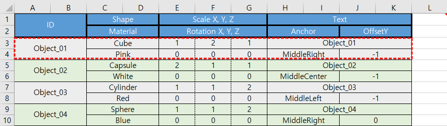

# Writing DataTableSchema

[DataTableSchema][]는 파싱할 테이블이 있는 시트 안에 있는 셀 주석에서 정의합니다.

셀 주석은 위치에 상관 없이 테이블과 같은 시트안에만 있으면 됩니다.

아래의 그림들은 예제 파일 **XlsxParser_02.xlsx**에 정의된 테이블의 일부를 보여줍니다.

* * *
**그림-1** 

* * *
**그림-1**에서 보는바와 같이 테이블은 파싱이 진행되는 방향에 따라 행 또는 열이 고정된 길이여야만 된다는 제약 외에는 표현의 자유를 제약하지 않습니다.

이는 테이블을 만들 때 다른 요소는 고려하지 않고 가독성과 작업의 편의성과 효율성만 고려하여 작업을 할 수있다는 것을 의미합니다. 

빨간 점선으로된 사각형은 **블럭**이라 하며 스키마에서 정의된 [Field][]들이 모두 포함된 최소한의 범위입니다.

**블럭**은 [XlsxParser][]에 의해 파싱된 후에 [DataTable][]의 행이 됩니다. 

[DataTable][]이 생성 과정은 모든 [Field][]의 값이 비어있는 **블럭**을 만나거나 시트의 끝에 다다르면 완료됩니다. 그러나 일부 [Field][]들에만 값이 있는 경우에는 [DataTable][]에 에러가 저장되고 생성이 완료됩니다.

[XlsxParser][]의 파싱 작업은 에러 유무 상관 없이 계속 진행됩니다. 

* * *
**그림-2** 

* * *
**그림-2**는 셀 주석에 있는 **그림-1**의 테이블을 정의한 스키마입니다.

주의할 점은 반드시 공백문자 없이 "\[\[" 문자열로 시작해야 한다는 것입니다.
만약 그렇지 않다면 [XlsxParser][]는 이를 일반 셀 주석으로 판단하고 아무 작업도 하지 않을 것입니다.

가장 첫번째 줄의 "\[\[" 다음에 나오는 문자열은 테이블의 이름으로서 [DataTableSchema.name][]에서 값을 얻어올 수 있습니다.

두번때 줄부터 마지막 줄 전까지는 [Field][]를 정의 하는 부분입니다.

줄의 첫번째에 나오는 "\[ \]" 안에 있는 값은 시작 **블럭**에 있는 [Field][]의 주소를 가리키며 [Row.startRef][]와 [Field.rowOffset][], [Field.colOffset][]을 이용해 값을 알아낼 수 있습니다. 
주소의 형식은 **A1스타일**이고 절대 주소입니다. 

그 다음에 오는 ':'문자 전 까지의 문자열은 [Field][]의 이름으로서 
[Field.name][]에서 값을 얻어올 수 있습니다.

':'문자 뒤에 있는 부분은 [Field][]의 타입으로서 [Field.type][]에서 값을 얻어올 수 있습니다. 
**XlsxParser**에서 기본적으로 제공하는 타입은 다음과 같습니다. 

Type | Descryption
---- | -----------
string  | 문자열입니다. **System.String**과 같습니다.
number  | 숫자입니다. **System.Double**과 같습니다.
boolean | 부울값입니다. **System.Boolean**과 같지만 값의 문자열은 항상 소문자로 표현됩니다.
object  | 객체입니다. 내부적으로 사용되며 [Field][]의 타입으로 사용할 수 없습니다.
array   | 배열입니다. 내부적으로 사용되며 [Field][]의 타입으로 사용할 수 없습니다.

직접 정의한 타입을 추가하고 싶으시면 [IFieldTypeConverter][]인터페이스를 구현 하셔야 합니다.

[Field][]의 이름에서 '.'문자로 구분되는 문자열을 [FieldNameNode][]라 하는데 맨 마지막을 제외한 나머지 [FieldNameNode][]는 타입을 "object" 또는 "array"만 타입으로 갖습니다.

마지막 줄은 스키마의 정의를 마치는 부분입니다.

"\]\]"문자열 뒤에 있는 부분은 다음 **블럭**을 지정하는 부분으로서 앞의 영문부분은 방향, 뒤의 숫자 부분은 이동하는 칸수를 나타냅니다.

이동 방항은 'D'(Down)또는 'R'(Right)로 설정이 가능하며 [DataTableSchema.isRotated][]에서 값을 얻어올 수 있습니다.

이동할 셀의 개수는 항상 양수이며 [DataTableSchema.nextBlockOffset][]에서 값을 얻어올 수 있습니다.

* * *
만약 스키마를 파싱하는 도중에 에러로 발생하게 된다면 [DataTable][]은 생성되지 않습니다. 에러가 발생한 [DataTableSchema][]는 [XlsxParser.erroredSchemas][]에서 가져올 수 있습니다.

에러는 [DataTableSchema.errors][]에서 가져올수 있지만 [XlsxParser.errors][]에서 가져오는 것을 추천합니다.  

**XlsxParser_01.xlsx** 파일에 있는 **InvalidTables** 시트를 통해 다양한 에러 상황을 확인하실 수 있습니다.

* * *
만약 코드상에서 [DataTableSchema][]를 정의 하고 싶으면 [XlsxRequest.AddPdtsText(int, string)][]메소드를 참조해 주십시오.

* * *

[DataTableSchema]:                 ../03-API/DataTableSchema.html
[DataTableSchema.name]:            ../03-API/DataTableSchema.html#05
[DataTableSchema.errors]:          ../03-API/DataTableSchema.html#11
[DataTableSchema.isRotated]:       ../03-API/DataTableSchema.html#07
[DataTableSchema.nextBlockOffset]: ../03-API/DataTableSchema.html#08

[Field]:           ../03-API/DataTableSchema.Field.html
[Field.name]:      ../03-API/DataTableSchema.Field.html#04
[Field.type]:      ../03-API/DataTableSchema.Field.html#05
[Field.rowOffset]: ../03-API/DataTableSchema.Field.html#02
[Field.colOffset]: ../03-API/DataTableSchema.Field.html#03

[Row.startRef]: ../03-API/DataTable.Row.html#00

[FieldNameNode]: ../03-API/DataTableSchema.FieldNameNode.html

[IFieldTypeConverter]: ../03-API/DataTable.IFieldTypeConverter.html

[XlsxParser]:                ../03-API/XlsxParser.html
[XlsxParser.erroredSchemas]: ../03-API/XlsxParser.html#04       
[XlsxParser.errors]:         ../03-API/XlsxParser.html#05

[DataTable]:       ../03-API/DataTable.html

[XlsxRequest.AddPdtsText(int, string)]: ../03-API/XlsxRequest.html#06
